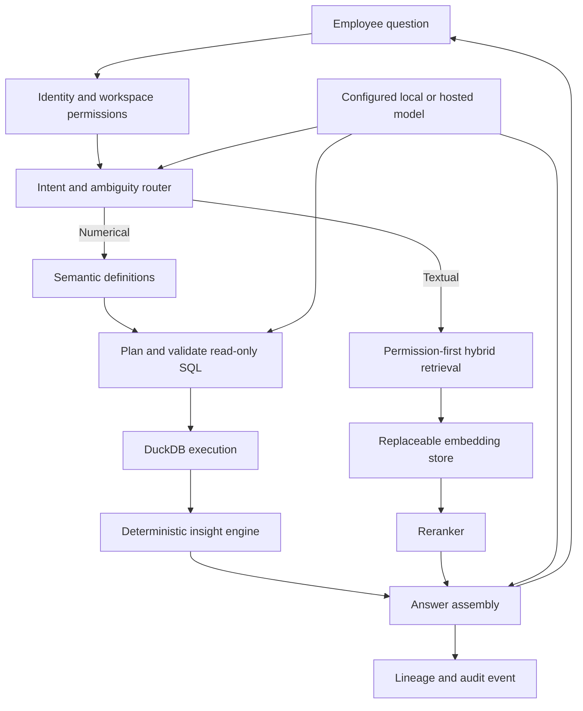

> **File use case:** Technical source of truth for ExecPlus system structure and request flows.
> **What it does:** Converts the product definition and reference diagram into enforceable components, boundaries, and data paths.

# ExecPlus Architecture

## Architectural style

ExecPlus begins as a modular monolith with independently testable modules and explicit infrastructure ports. This preserves transaction simplicity and delivery speed while allowing workers or high-load compute paths to be extracted when measurements justify it.

The deployable units are:

- `apps/web`: browser-facing Next.js application.
- `apps/api`: FastAPI control plane and synchronous request orchestration.
- Future worker process: ingestion, profiling, embedding, insight, and export jobs using the same application core.
- PostgreSQL: identity references, workspaces, permissions, metadata, threads, lineage, and audit records.
- Object storage: original uploads, normalized artifacts, and generated exports.
- DuckDB: exact analytical execution over a workspace-authorized dataset snapshot.
- Configurable models: local or hosted language-model providers behind one port.
- Configurable retrieval: an optional embedding store behind one port; no vendor is selected in Phase 0.

## Trust boundary

All application data, model endpoints, query execution, logs, and retrieval stores belong inside the configured customer or managed-cloud environment. A hosted model can be enabled only by explicit deployment configuration and must receive the minimum required schema or authorized passages. Raw datasets are not sent to a model.

## Query flow

Models may propose an intent, SQL plan, wording, or chart specification. Only the execution adapter supplies numerical values. Answer assembly rejects numerical claims without a matching result and lineage reference.

## Module boundaries

| Module | Owns | Must not own |
| --- | --- | --- |
| Domain | Entities, value objects, invariants, errors | HTTP, database, model, or vendor SDKs |
| Application | Use-case orchestration and provider protocols | Framework request objects or concrete vendors |
| Presentation | HTTP transport, validation, status mapping | Business computation or persistence logic |
| Infrastructure | Database, object storage, query, model, and retrieval adapters | Product policy |
| Web | User interaction and server-side composition | Trusted numerical computation |

## Tenant isolation

Every tenant-owned aggregate carries `workspace_id`. Authorization creates a request scope containing the actor, workspace, role, and permitted dataset identifiers. Repositories require that scope rather than accepting an unscoped record identifier. PostgreSQL row-level security will be defense in depth; it does not replace application-level authorization.

Object keys follow a workspace prefix. Analytical files are opened only after the dataset has been authorized. Retrieval filters are applied before semantic search and repeated after retrieval. Audit records retain workspace and actor identifiers.

## Exact computation boundary

The query pipeline has discrete states: interpreted, needs clarification, validated, executed, refused, and failed. SQL must parse as a single read-only statement and reference only an allowlisted logical dataset view. Execution has row, memory, and time limits. The answer assembler consumes typed result cells plus lineage rather than arbitrary model-generated figures.

## Model routing

`EXECPLUS_LLM_MODE` selects `disabled`, `local`, or `hosted`. Both active routes use an OpenAI-compatible protocol initially, avoiding SDK coupling. Model routing policy will later select a small model for classification and a stronger model for planning or narrative assembly. Secrets and endpoints enter only through environment configuration.

## Vector readiness

The `EmbeddingStore` application protocol captures the stable capability needed by ExecPlus: upsert workspace-scoped chunks, permission-filtered search, and deletion by dataset. Vendor-specific collection names, filter syntax, indexes, and SDK types remain inside future infrastructure adapters.

A vendor will be selected only after Phase 3 evaluation of metadata filtering, multitenancy, hybrid search, local hosting, managed hosting, backup and restore, operational complexity, latency, and total cost.

## Observability and privacy

Logs use request, workspace, actor, dataset, thread, query, and model-run identifiers. They exclude uploaded row values, prompts containing source passages, secrets, and access tokens by default. Metrics cover request latency, ingestion outcomes, clarification rate, query refusal rate, execution time, model usage, retrieval relevance, and answer-verification failures.

 